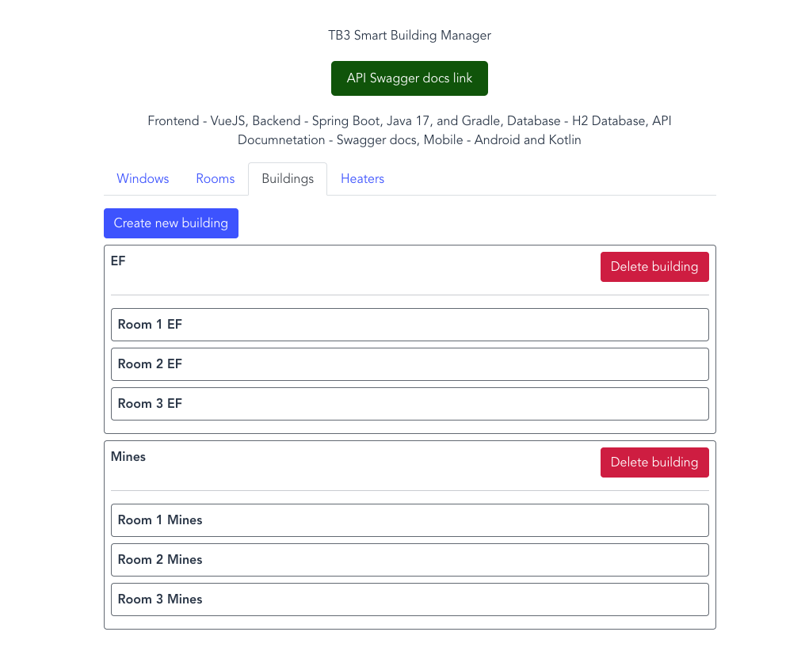

# TB3 Smart Building Manager Frontend VueJS

**Developer:** Anjolaoluwa Adeuyi Joshua

## Overview

TB3 Smart Building Manager Frontend VueJS App manages the buildings, rooms, windows

### course dev web tp 4 vuejs emse1 assignment submission with additional features and functionalities




## Prerequisites

Before you begin, ensure you have installed the following:

- NodeJS
- NPM (Node Package Manager)

## Getting Started

The [backend repository](https://github.com/anjola-adeuyi/TB3_Smart_Building_Manager_Backend.git) as well as the corresponding [frontend vue.js repository](https://github.com/anjola-adeuyi/TB3_Smart_Building_Manager_Frontend_VueJS.git) are on GitHub, hosted on clevercloud at [automacorp-anjola-adeuyi.cleverapps.io](http://automacorp-anjola-adeuyi.cleverapps.io/) with a swagger docs API link at [automacorp-anjola-adeuyi.cleverapps.io/swagger-ui](https://automacorp-anjola-adeuyi.cleverapps.io/swagger-ui/index.html).

### API Information

#### User Authentication:

- Admin Role: Username - `admin`, Password - `password`
- User Role: Username - `user`, Password - `password`

#### API EndPoints:

- Buildings: [http://automacorp-anjola-adeuyi.cleverapps.io/api/buildings](http://automacorp-anjola-adeuyi.cleverapps.io/api/buildings)
- Rooms: [http://automacorp-anjola-adeuyi.cleverapps.io/api/rooms](http://automacorp-anjola-adeuyi.cleverapps.io/api/rooms)
- Heaters: [http://automacorp-anjola-adeuyi.cleverapps.io/api/heaters](http://automacorp-anjola-adeuyi.cleverapps.io/api/heaters)
- Windows: [http://automacorp-anjola-adeuyi.cleverapps.io/api/windows](http://automacorp-anjola-adeuyi.cleverapps.io/api/windows)

## Project setup

```
npm install
```

### Compiles and hot-reloads for development

```
npm run dev
```

### Compiles and minifies for production

```
npm run build
```

### Customize configuration

See [Configuration Reference](https://cli.vuejs.org/config/).
